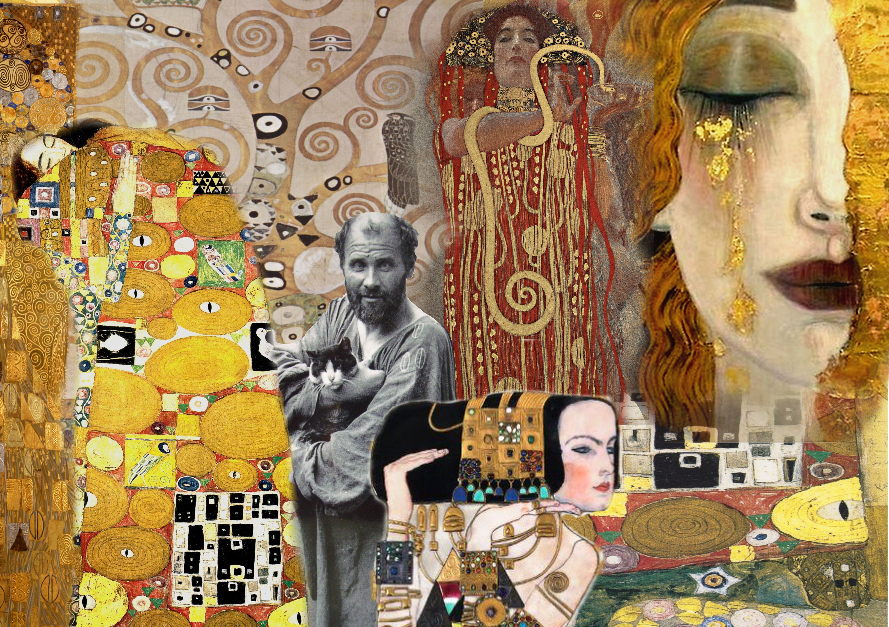

# Gustav Klimt

LICENSE: [MIT](./licence.md)

 

---
Сайт посвящен известному австрийскому художнику **Густаву Климту**, чьи образы  и стиль написания считаются наиболее выразительными среди живопсцев двадцатого века. 

Идея сайта - полотна, выставленные в музее, в связи с чем было принято решение исользовать стили. 

Основная верстка сайта сделана при использовании синтаксиса *html*:
* вставка изображений; 
* выделение заголовков и абзацей;
* атрибуты для вставки ссылкок;
* проставление центрирования и акцентов;
* разрывы строк;
* комментарии.

Для реализации идеи некоторые элементы были добавлены с использованием синтаксиса css:
* вставка изображения для фона страниц;
* хэдеры и футеры с добавлением прозрачности;
* вставка картинок в хэдер как ссылок.

[Ссылка на сайт](./site/index.html)